# Containerized ECS Fargate IT Tools Deployment on AWS

> A production-style, containerizing and deploying [IT Tools](https://github.com/CorentinTh/it-tools) on AWS ECS Fargate with Terraform, HTTPS, a custom domain, and fully automated CI/CD pipelines.

---

## Demo

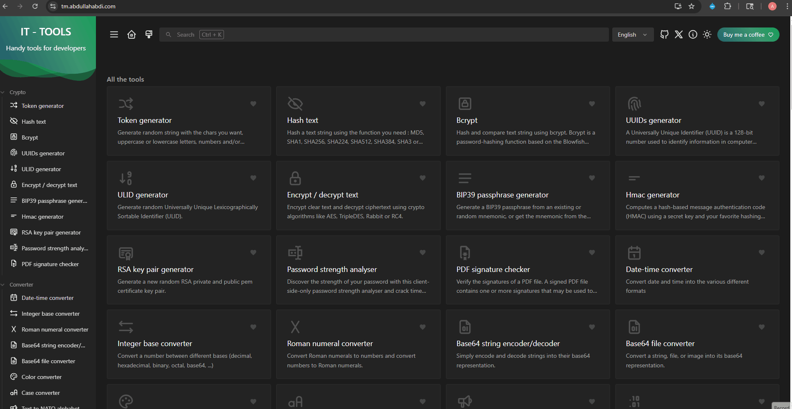

---

## Overview

This project takes IT Tools, an open-source developer utility app, and deploys it as a production-grade workload on AWS. The infrastructure follows a real-world pattern: a containerized app served behind an Application Load Balancer with HTTPS termination, running on ECS Fargate in private subnets, with all infrastructure managed as code using Terraform and deployments automated through GitHub Actions.

---

## Architecture


The traffic flow works as follows: a user's browser resolves `tm.abdullahabdi.com` via Cloudflare DNS, which points to the ALB DNS name. The ALB sits in public subnets and terminates TLS using an ACM certificate. It then forwards requests to ECS Fargate tasks running in private subnets on port 8080. The tasks pull their container image from ECR on startup. A regional NAT Gateway handles outbound internet access from private subnets.

---

## Tech Stack

| Layer | Technology |
|---|---|
| App | IT Tools (Vue.js / TypeScript) |
| Containerization | Docker (multi-stage build, nginx) |
| Container Registry | Amazon ECR |
| Compute | Amazon ECS Fargate |
| Load Balancer | Application Load Balancer (ALB) |
| HTTPS | AWS Certificate Manager (ACM) |
| DNS | Cloudflare + Route 53 |
| Networking | Custom VPC, public/private subnets, NAT Gateway |
| Infrastructure as Code | Terraform (modular) |
| State Management | S3 backend with native locking |
| CI/CD | GitHub Actions with OIDC |
| Security Scanning | Trivy (container), Checkov (IaC) |
| Logs | Amazon CloudWatch |

---

## Repository Structure

```
.
├── app/
├── bootstrap/
│   └── bootstrap.sh
├── Dockerfile
├── nginx.conf
├── infra/
│   ├── main.tf
│   ├── variables.tf
│   ├── outputs.tf
│   ├── provider.tf
│   └── modules/
│       ├── vpc/
│       ├── security_groups/
│       ├── iam/
│       ├── acm/
│       ├── route53/
│       ├── alb/
│       └── ecs/
├── .github/
│   └── workflows/
│       ├── app-pipeline.yml
│       ├── terraform-deploy.yml
│       └── terraform-destroy.yml
├── images/
├── .pre-commit-config.yaml
├── .dockerignore
├── .gitignore
└── README.md

```

---

## Prerequisites

Before you begin you need the following installed:

- [AWS CLI](https://aws.amazon.com/cli/) configured with appropriate credentials
- [Terraform](https://www.terraform.io/) >= 1.12.0
- [Docker](https://www.docker.com/)
- [Node.js](https://nodejs.org/) and [pnpm](https://pnpm.io/)
- An AWS account
- A domain managed through Cloudflare

---

## Bootstrap (Run Once)

Before the pipelines can run, three prerequisites need to exist: an S3 bucket for Terraform state, an ECR repository for Docker images, and an OIDC identity provider with an IAM role for GitHub Actions authentication.

Run the bootstrap script once from your terminal:

```
cd bootstrap
chmod +x bootstrap.sh
./bootstrap.sh

```

The script creates:
- S3 state bucket with versioning and public access blocked
- ECR repository with image scanning enabled
- OIDC identity provider for GitHub Actions
- IAM role with trust policy scoped to this repository

After it completes, add these two secrets to your GitHub repository under Settings -> Secrets -> Actions:

| Secret | Value |
|---|---|
| `AWS_ROLE_ARN` | Printed at the end of the bootstrap script |
| `AWS_REGION` | `us-east-2` |

---

## Local Setup

### Run with Docker

```
git clone git@github.com:AbdullahHAbdi/it-tools-ecs-fargate.git
cd it-tools-ecs-fargate

docker build -t it-tools .

docker run -p 8080:8080 it-tools

```

Then open [http://localhost:8080](http://localhost:8080) in your browser.

---

## Docker Image Optimization

The Dockerfile uses a multi-stage build to keep the final image as small as possible. A Node.js builder stage compiles the TypeScript/Vue source into static files, then only the compiled `dist/` output is copied into a lightweight `nginx:stable-alpine` runtime image. Node.js, pnpm, and all build tooling are discarded entirely, bringing the final content size down to **34MB**.

Additional hardening: non-root user, custom nginx config on port 8080, and `.dockerignore` to exclude `node_modules` from the build context.

---

## CI/CD Pipelines

All pipelines authenticate with AWS using OIDC; no static AWS credentials are stored anywhere. GitHub Actions assumes an IAM role via a short-lived token that expires when the job finishes.

**App Pipeline** triggers automatically on any push to `main` that changes `app/`, `Dockerfile`, or `nginx.conf`. It builds the Docker image tagged with the commit SHA, pushes it to ECR, and forces a new ECS deployment.

**Terraform Deploy Pipeline** triggers automatically on any push to `main` that changes files under `infra/`. It runs `terraform fmt -check`, `terraform init`, `terraform validate`, `terraform plan`, and `terraform apply`.

**Terraform Destroy Pipeline** is manual only (`workflow_dispatch`). It requires a deliberate button click in the GitHub UI and will never trigger automatically.

### Pipeline Screenshots

**App Pipeline - Build and Push**

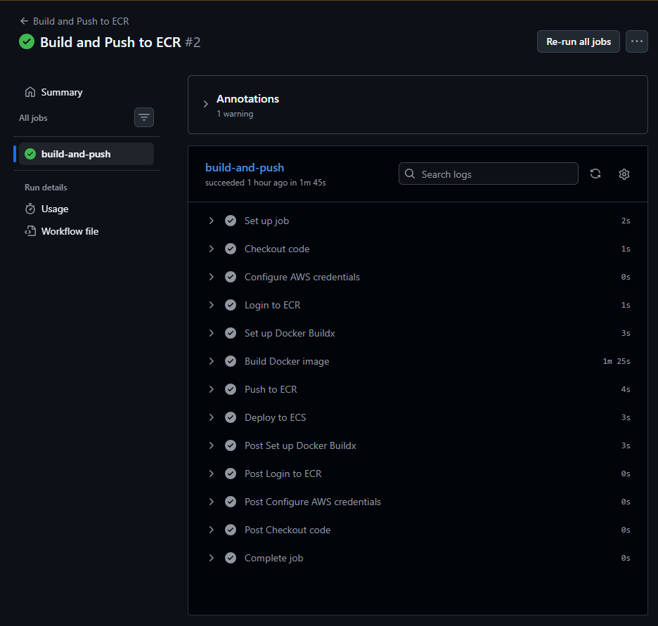

---

**Terraform Deploy Pipeline**

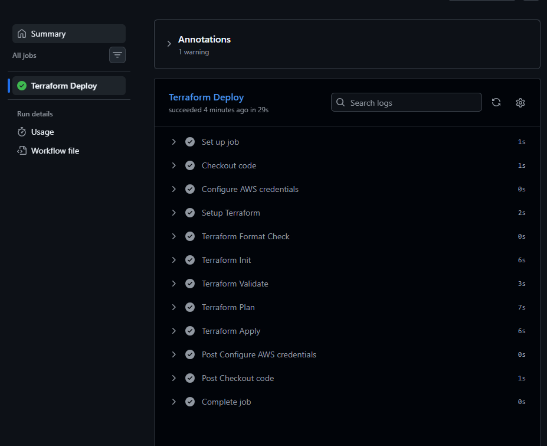

---

**Terraform Destroy Pipeline**

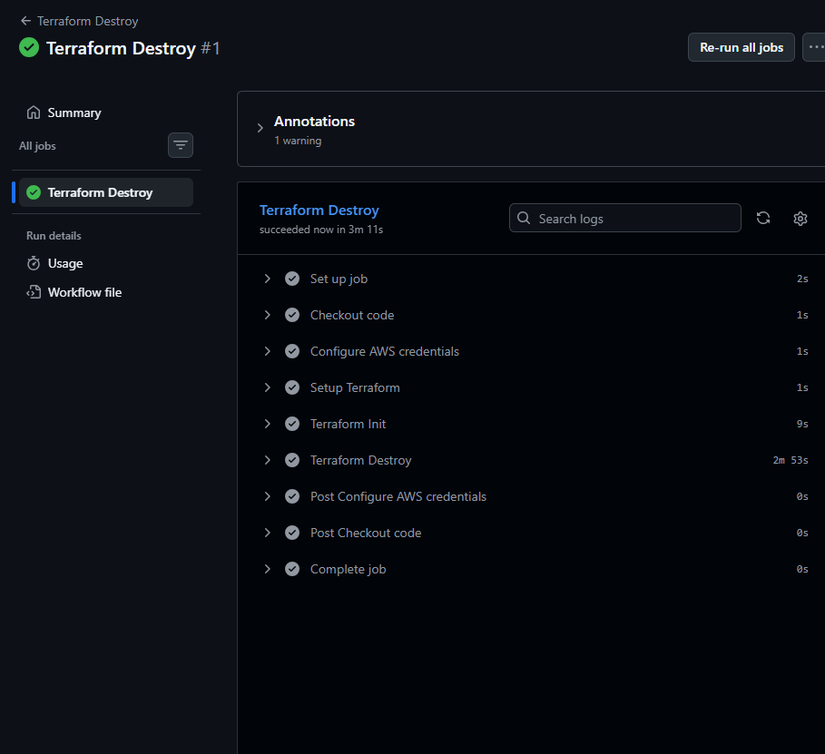

---

## AWS Console Screenshots


**ECS Service - Running Tasks**

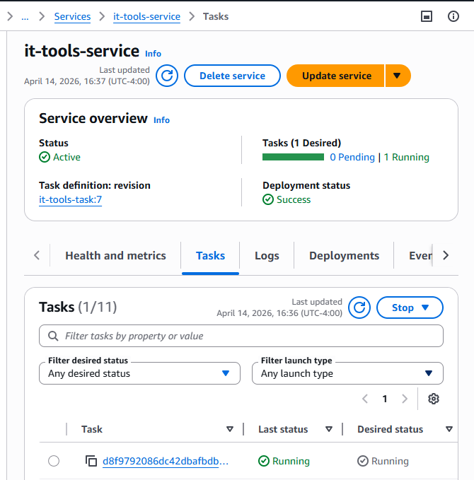

---

**ALB - Active Status**

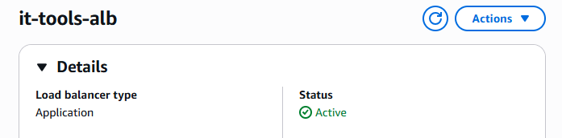

---

**Target Group - Healthy Targets**

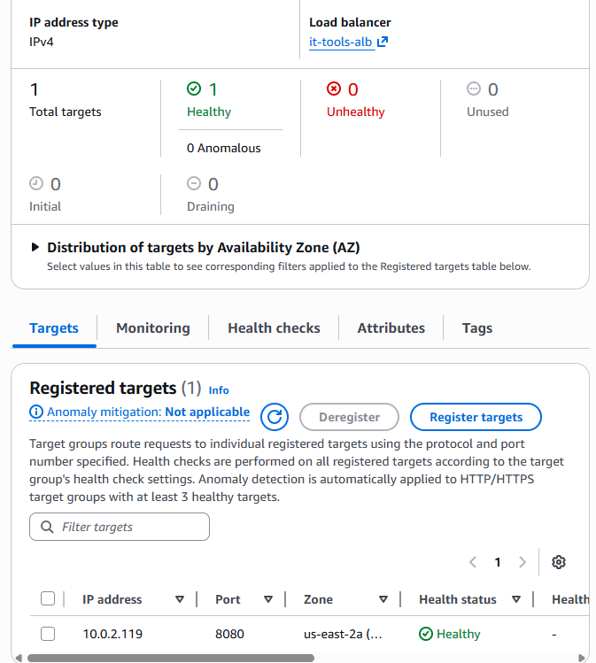

---

**ECR - Image Pushed**

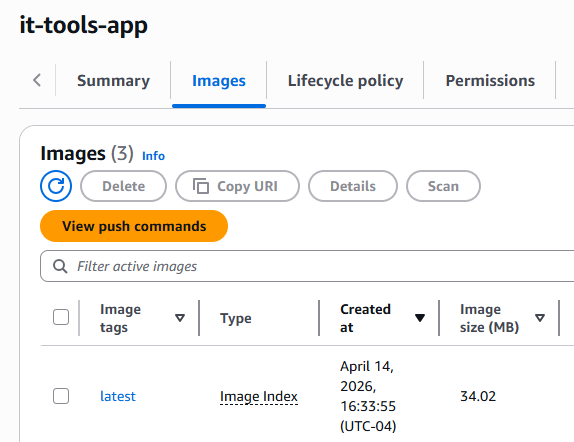

---

**ACM Certificate - Issued**

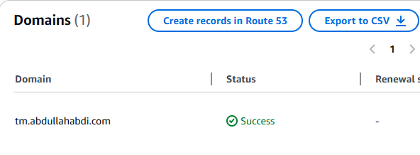

---

**Terraform State in S3**

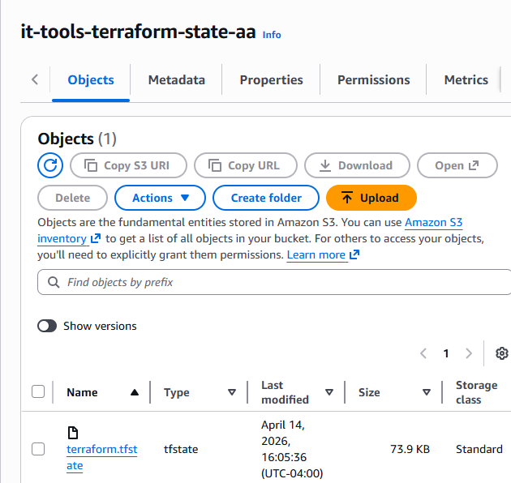

---

**HTTPS Certificate in Browser**

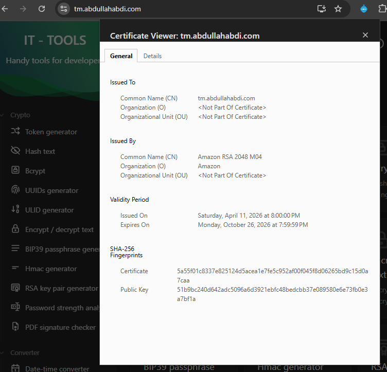

---

## Architecture Decisions

**Fargate over EC2**

* No EC2 instances to patch or manage. AWS handles the underlying infrastructure, allowing focus on the application and deployment pipeline.

**Private subnets for ECS**

* ECS tasks run in private subnets with no direct internet access. All inbound traffic must go through the ALB, and outbound traffic routes through the NAT Gateway.

**S3 native locking over DynamoDB**

* AWS introduced native S3 state locking which eliminates the need for a separate DynamoDB table, simplifying the bootstrap requirements.

**OIDC over static credentials**

* GitHub Actions uses OIDC to assume an IAM role with short-lived tokens instead of storing long-lived AWS access keys as secrets.

**Single NAT Gateway**

* A single regional NAT Gateway serves both private subnets. In production you would use one per AZ for high availability, but for this project cost optimization takes priority.

**Immutable ECR tags**

* Images are tagged with the git commit SHA and ECR is configured with immutable tags, ensuring every deployment is traceable and images cannot be accidentally overwritten.

---

## Future Improvements

- Move to a multi-environment setup (staging and production) using Terragrunt
- Add auto-scaling to the ECS service based on CPU/memory CloudWatch alarms
- Add a Terraform plan pipeline that runs on pull requests and posts the plan as a PR comment
- Add a docker-compose.yml for easier local development

---
